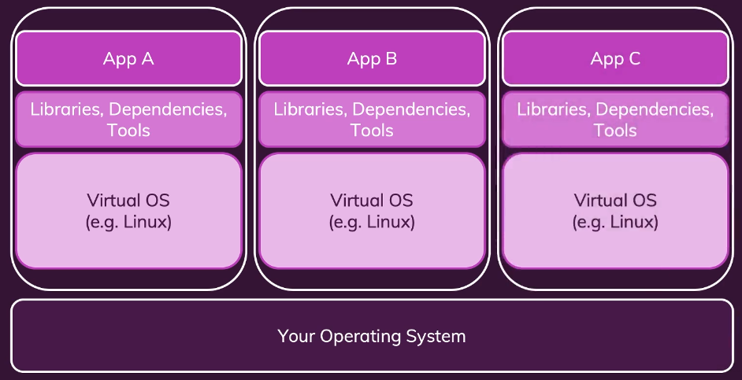
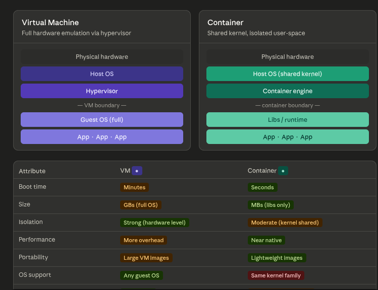

## What is docker?
tool for creating and managing containers.

## What is container?
A package of code and dependencies to run that code.
The same container always yields the exact same application and behaviour! No matter where or by whom it might be executed.

## Why we need containers?
We need the exact same environment for development and production to ensure the code works as tested.

## Virtual Machines vs Docker Containers:
Virtual machine 
- is a software based emulation of a physical computer. It runs on a physical machine called the host but behaves like a completely separate computer with its own operating system, CPU, memory storage, and network interfaces. 
-A software called hypervisor (VMware, VirtualBox, Hyper-V) sits between physical hardware and the virtual machines. It divides and allocates the host's physical resources like the CPU cores, RAM, disk space etc among one or more VMs.

Container:

## Docker Tools:
1. Docker engine
2. Docker desktop (daemon and cli)
3. Docker Hub
4. Docker Compose

## what is difference between images and containers
Images
- Templates/blueprints for containers.
- contains code + required tools/runtimes
Containers
- The running unit of software
- multiple containers can be created based on one image

## images:
1. we can pull and use pre existing/ pre built images
2. we can create our own images

## what are layers in images

1st file:

FROM node                      -----> base image

WORKDIR /app                   -----> tells docker that all the commands will be executed from this folder as root folder
 
COPY . /app                    -----> copy everything in our folder to the /app directory

RUN npm install                -----> RUN will be executed while making the image 

EXPOSE 80                      -----> only for documentation purposes (Works with -P (publish all). If you run docker run -P my-app, Docker automatically maps all EXPOSEd ports to random host ports. Without EXPOSE, -P has nothing to map.)

CMD ["node", "server.js"]      -----> CMD will be executed when the container is created based on the image

2nd file: optimization : since the npm install shouldnt run each time even if only the code is changed thats why we only copy the package json first and then npm i so that this layers are skipped as they are already present in cache and only the code changes are rebuild when we build the image again.

FROM node

WORKDIR /app

COPY package.json /app

RUN npm install

COPY . /app

EXPOSE 80

CMD ["node", "server.js"]

omkar2004@omkar-HP-Laptop-15s-fq5xxx:~/Devops/tut1/nodejs-app-first-dockerfile$ docker build .
[+] Building 1.2s (10/10) FINISHED                                                                                                            docker:default
 => [internal] load build definition from Dockerfile                                                                                                    0.0s
 => => transferring dockerfile: 152B                                                                                                                    0.0s
 => [internal] load metadata for docker.io/library/node:latest                                                                                          0.9s
 => [internal] load .dockerignore                                                                                                                       0.0s
 => => transferring context: 2B                                                                                                                         0.0s
 => [1/5] FROM docker.io/library/node:latest@sha256:a2f09f3ab9217c692a4e192ea272866ae43b59fabda1209101502bf40e0b9768                                    0.0s
 => [internal] load build context                                                                                                                       0.0s
 => => transferring context: 4.39kB                                                                                                                     0.0s
 => CACHED [2/5] WORKDIR /app                                                                                                                           0.0s
 => CACHED [3/5] COPY package.json /app                                                                                                                 0.0s
 => CACHED [4/5] RUN npm install                                                                                                                        0.0s
 => [5/5] COPY . /app                                                                                                                                   0.1s
 => exporting to image                                                                                                                                  0.1s
 => => exporting layers                                                                                                                                 0.0s
 => => writing image sha256:b358e06e5c4796208c4b4d4df180b7ed4ccb3bcd88051872eceec7b8eb51e8b2

 ## learnings
 - using --help effectively you dont need to memorized anything

 -  managing images and containers:
    -   images can be tagged, listed, analyzed, removed
    -   containers can be named, can be configured in detail,  can be listed, can be removed

 - stopping and restarting containers using docker run container_name

 - attached and detached containers using flags -a, -d, logs, attach etc
    Attached mode (docker run): your terminal is connected to the container's output in real time — you see logs but can't use the terminal for anything else.
    Detached mode (docker run -d): the container runs in the background and your terminal is free immediately.

 - seel all logs of a container
    docker logs <container_name>

 - As an additional quick side-note: For all docker commands where an ID can be used, you don't always have to copy / write out the full id. You can also just use the first (few) character(s) - just enough to have a unique identifier.

 - Interactive mode - 
    -i flag - keep STDIN open even if not attached to input something
    -t  flag - allocate a pseudo -TTY  (expose a terminal) 

# COMMANDS :
1. building image : docker build .
2. running a container : docker run --help
    - docker run -p 3000:80 <image_id>  --------> 3000 machine port and 80 the port we are exposing in our docker file ---> p means publish
3. stopping a container :
    - docker stop <container_name>
4. see running containers : 
    - docker ps
5. see all containers (stopped + running):
    - docker ps -a
6. restarting docker container
    - docker start <container_name>
7. running in attached and detached mode
    - docker run -p 3000:80 -d <image_id>  (-d for detached , -a for attached)
8. attaching to container
    - docker attach <running_container_name>
9. entering docker in interactive mode
    - docker run -i
10. restarting docker container in interactive mode with new terminal
    - docker run -i -t
11. deleting docker containers manually
    - docker rm <container_name1> <container_name2> <container_name3>
12. remove all stopped containers at once
    - docker container prune
13. see all images
    - docker images
14. delete a image  (you cannot remove images used by a container -> you need to delete the container first)
    - docker rmi <image_id>
15. remove all unused images
    - docker image prune
16. removing stopped containers automatically
    - using the --rm flag (for example when you are stopping a node server it is probably becoz of code changes where you have to rebuild a image anyways and run a new container)
    - docker run -p 3000:80 --rm <image_id> 
17. inspecting images
    - docker image inspect <image_id>
18. copying files into the container 
    - docker cp <src> <container_name>:<dest_inside_container>
        ex : docker cp dummy/. cunning_fox:/test
19. copying files from the container
    - docker cp <container_name>:<src_inside_container> <dest> 
        ex : docker cp cunning_fox:/test dummy
20. naming a container (--name tag)
    - docker run -p 3000:80 -d --rm --name goalsapp <image_id>
    - next time you can use you custom name - docker stop <custom_container_name>
21. tagging images (-t tag)
    - docker build -t goals:latest .
    - next time we can use this name
        docker run -p 3000:80 -d --rm --name myapp goals:latest
22. sharing images
    - everyone who has an image can run a container based on that image
    - share zip file with the code and dockerfile
    - share the image directly
23. see all past logs of a container :
    - docker logs <container_name>
24. continue seeing the logs of a container :
    - docker logs -f <container_name>
25. pushing image on docker hub:
    a. create an account on docker hub
    b. create a repository on the docker hub
    c. run "docker login" commandon your local
    d. set the image name same as that of the account_name/repository_name
    e. docker push account_name/repo_name
26. retagging an image
    - docker tag old_name new_name
27. pulling and using shared images
    - docker pull account_name/repository_name
    - if you pushed the latest version of the image you need to do pull again to get the latest version in your local